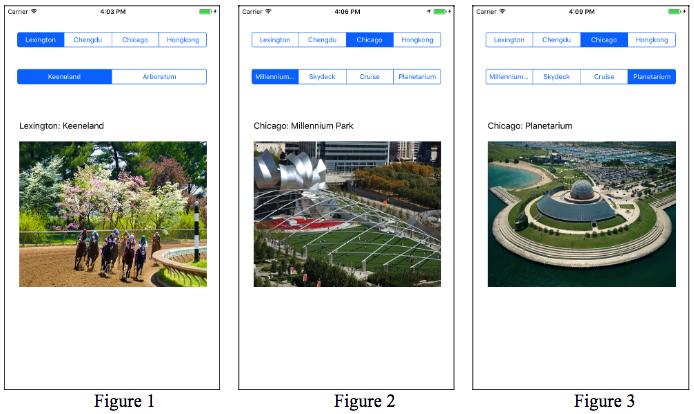

## Assignment 2
Due 2/15

Write a travel guide application for iPhone 8 to advise the tourist attractions of cities.
* The cities and their attractions the application needs to consider include:
    * Lexington: Keenland, Arboretum
    * Chengdu: Panda, Pedestrian Street
    * Chicago: Millenium Park, Skydeck, Cruise, Planetarium
    * Hongkong: Disneyland, Ocean Park, The Peak
* According to the user's selection, the application displays the chosen city's name and attraction, as well as the corresponding picture.

Figure 1 is the screenshot when the application first starts. When a different city is selected (e.g., Chicago), the first attraction of the city will be displayed as in Figure 2. Selecting another attraction will result in the display of a new picture as in Figure 3.

**Hint**:
* The following methods of segmented controls can be used to delete all segments and then insert new segments at the specified location with the given title.
    * `removeAllSegments()`
    * `insertSegment(withTitle:, at:, animated:)`
* The following method of segmented controls read the title of a segment at the specified location.
    * `titleForSegment(at:)`
