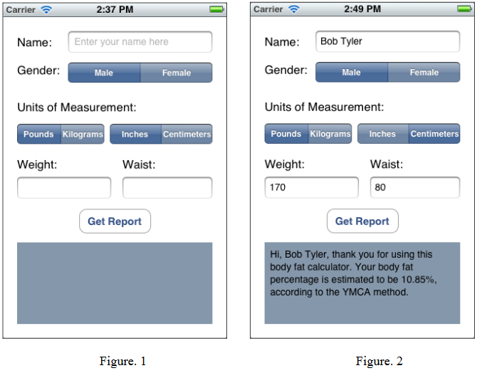

## Assignment 3
Due 2/22

Write a YMCA body fat calculator for iPhone 8.
* The application should provide an interface (*Figure 1*) to allow the user to:
    * Enter the name, the first letters of which should be automatically capitalized
    * Specify the gender and units of measurements
    * Enter the weight and waist
* According the user's input, when clicking the button "Get Report", the application should generate a report for the user, as shown in *Figure 2*

The YMCA formula for calculating body fat can be found at http://www.doithome.com/help_inside3.html
