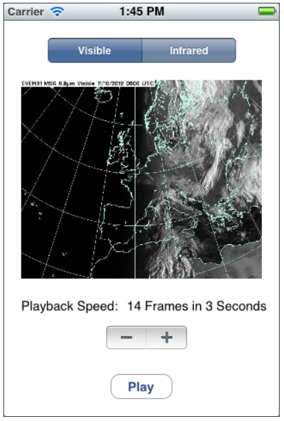

## Assignment 4
Due 3/1

Write an iPhone 8 application to play satellite animation.
* The application should provide an interface, as shown in the figure below, to allow the user to
    * Select the type of satellite images (visible or infrared)
    * Increment or decrement the playback speed, which is one of the following possible speeds:
        * 14 frames every 1 second (highest playback speed)
        * 14 frames every 2 second
        * 14 frames every 3 second
        * 14 frames every 4 second
        * 14 frames every 5 second (lowest playback speed)
* According to the user's inpurt, when clicking the button, labeled with "Play" or "Stop", the application should play or stop the animation.

The satellite images can be downloaded from Blackboard. They are borrowed from: http://www.metoffice.gov.uk/satpics/latest_VIS.html
