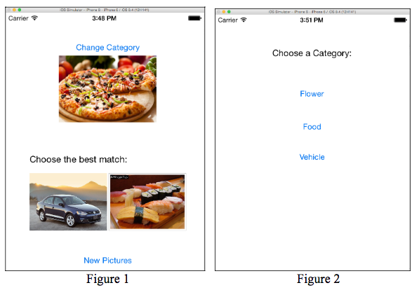
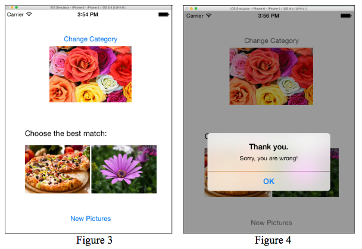
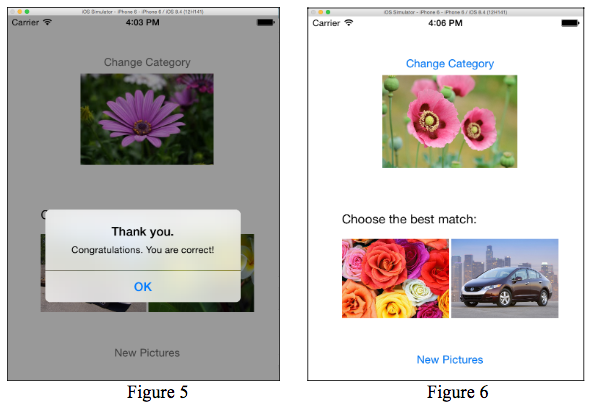

## Assignment 6
Due 3/21

Write an iPhone 8 application that asks user to select a picture to match the category of a given picture. The interface of application is shown in **Figure 1**.

The top picture is the question picture. The bottom two are candidate pictures, one of which (i.e., the answer) should belong to the category that the question picture comes from. In this application, picture categories include flowers, food, and vehicles.

Picture should be randomly displayed according to the following rules:
1. When the application first starts, the category for the question picture is randomized. This category remains in effect until the user selects a different category.
2. The answer and question pictures are different while belonging to the same category. Another candidate picture comes from a different category.
3. The order between two candidate pictures are randomized.

Button "Change Category" triggers the display of a different view using a model segueas in **Figure 2**, in which the user can select the category for the question picture. Whenever a category is selected, the view will be dismissed and all pictures in the initial view should be updated accordingly. **Figure 3** shows an example screen after "Flower" button is clicked.

When the user clicks one of the candidate pictures, the title should be changed to "Selected" and an alert view is displayed to report result, as shown in **Figure 4 and 5**. After the alert view is dismissed, the application should randomly load new pictures, reset title to empty, and start over, as in **Figure 6**.

Pressing button "New Pictures" will load new pictures without changing the category for the question picture.

**Hints**:
1. The question picture can be displayed using an Image View.
2. Two candidate pictures can be implemented as buttons with background images.
3. In `ViewController` class, override method `viewWillAppear` so that every time initial scene is displayed, pictures are refreshed immediately.
