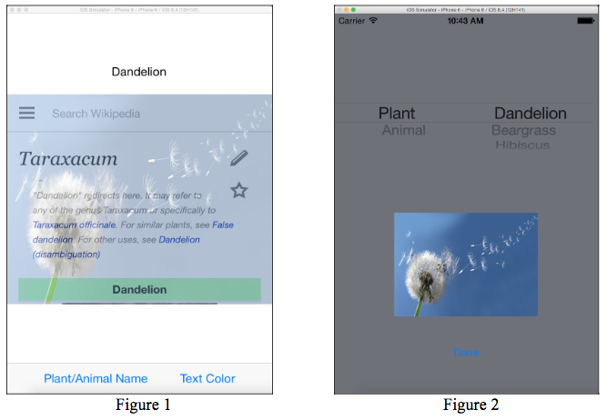
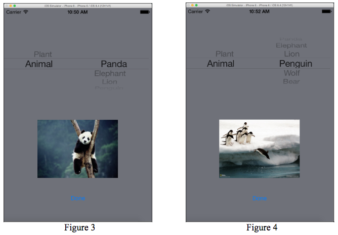
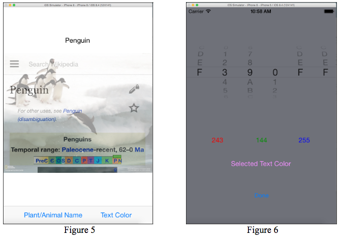
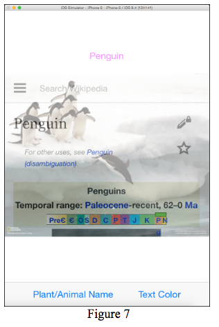

## Assignment 7
Due 4/3

Write an iPhone 8 application that displays the Wikipedia webpage of a selected plant or animal, as in **Figure 1**. When the application starts, *dandelion* is the default selection. The wikipedia webage for this plant is loaded, and "*dandelion.jpg*" is used as the background image. The default text color of the title is *black* (red: 0, green: 0, blue: 0).

Two bar button items "*Plant/Animal Name*" and "*Text Color*" in the toolbar allow users to change the plant or animal, and the text color of the title.
* When button "*Plant/Animal Name*" is clicked, a modal view will appear as **Figure 2**. Users can select the category among Plant and Animal. Plants include *dandelion*, *beargrass*, and *hibiscus*, and animals include *panda*, *elephant*, *lion*, *penguin*, *wolf*, and *bear*. Changing the category immediately leads to the update in the 2nd component of the picker. **Figure 3** shows the result after "*Animal*" is selected. After a selection through the picker has been made as in **Figure 4**, pressing button"*Done*" will dismiss the modal view and update the initial scene accordingly as in **Figure 5**.
* Pressing button "*Text Color*" will result in the display of another modal view, which allows users to change text color by specifying three hexadecimal numbers that are used as red, green, and blue vaules in the new color. Any new selection in the picker leads to the update on the decimal equivalents and the colors as in **Figure 6**. Pressing button "*Done*" will dismiss the modal view and update the initial scene as in **Figure 7**.
* Anytime when the modal views are displayed, the selections in the pickers should be consistent with the initial scene.






**Hints**:
* Place a web view on top of an image view in the initial scene
* Implement method `pickerView(_: titleForRow: forComponent)` in order to specify the text of each cell in picker
* Call method `reloadComponent(1)` in order to update the content of the 2nd component in a picker. Calling this method causes the picker view to query the delegate for new data for the 2nd component.
* To convert a hexadecimal string (e.g. "A5") to its decimal equivalent (i.e. 165), you can borrow the following code: 
```swift
var hexStr = "A5"
var decimal = (Int)(strtoul(hexStr, nil, 16))
```
* The following is an example to specify a text color using its red, green, and blue values (e.g. red: 100, green: 50, and blue: 200):
```swift
var r = 100
var g = 50
var b = 200
myLabel.textColor = UIColor(red: (CGFloat)(r)/255.0, green: (CGFloat)(g)/255.0, blue: (CGFloat)(b)/255.0, alpha: 1.0)
```
