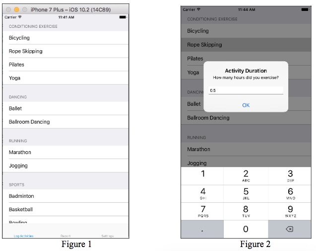

## Assignment 8
Due 4/10

Write an iPhone 8 application that logs the daily activities and reports the calories burned. The application also calculate the **Basic Metabolic Rate** (BMR) based on the gender, age, weight, and height.

There are three scenes controlled by a **tab bar controller** in the application. The `Log Activities` scene provides a table view for a user to log the number of hours for activities during the day, as in **Figure 1**. Tapping a cell for a certain activity in the table triggers the display of an alert window in which the user can enter the number of hours for this activity, as in **Figure 2**. The tapped cell should be updated, as in **Figure 3**, according to the number entered through the alert window. **Figure 4** shows the result after Rope Skipping (0.5 hours), Yoga (1.2 hours), and Badminton (2.5 hours) have been logged.

 The `Setting` scene allows the user to specify the gender, age, weight, and height, which are defaulted to female, 20 years old, 55 kilograms, and 165 entimeters, as in **Figure 5**. The user can change the gender (through a picker view), and age, weight, and height (through text fields) as in **Figure 6**.

 The `Report` scene displays the BMR and the calories that have been burned by the logged activities as in **Figure 7**. The BMR calculation should be based on the gender, age, weight, and height provied by the `Setting` scene using the following formuls:
 * **For men**: `BMR = 10 * weight (kg) + 6.25 * height (cm) - 5 * age (years) + 5`
 * **For women**: `BMR = 10 * weight (kg) + 6.25 * height(cm) - 5 * age (years) - 161`

 The calories burned per hour by activities can be found in the following table:

**Hints**:
* To allow the table view cells to include a label on the right side, use `Right Detail` as the style of the cells. You can use attribute `detailTextLabel` to access the detail label in a cell.
* To update the content of a certain cell at indexPath in a table view, call method `reloadRows(at: [indexPath], with: UITableViewRowAnimation.automatic)`
* Use `Decimal Pad` as the type of keyboard for age, weight, and height text fields.
